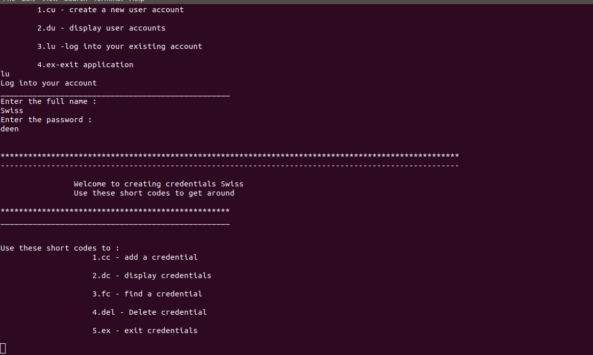

# Password-Locker
## Author
[Alvynah Wabwoba](https://github.com/alvynah)
#### By **{Self}**
## Description
Password Locker is a python application which allows users to store other account's credentials. It allows the users to create and log into their accounts.The users can then create the credentials for the accounts they would like to store.These credentials can be deleted, searched for and displayed.The users are also given an option of generating random credential passwords if they would not like to enter one themselves.

## Screenshot
1. Creating User Account
    

2. Login to user Account
    

3. Display user Account
    

4. Create credentials
    

5. Display credentials
    

6. Find Credentials
    

7. Delete Credentials
    

8. Exit credentials
    

9. Exit Password Locker
    

 
## Project Setup Instructions
### Pre-requisites
* python3.6
* pyperclip
* pip

### Set Up
* Open Terminal {Ctrl+Alt+T}
* git clone https://github.com/alvynah/Password-Locker.git
* cd Password-Locker
* code .(for Vs Code) or atom .(for Atom)
### Run Application
* chmod +x run.py
* ./run.py

## Technologies Used
1. python3.6
## Behaviour Driven Development

## Contact Information
For any further inquiries or contributions or comments, reach me at [Alvynah](juvatalvynah@gmail.com)
### License
 [MIT License](https://github.com/alvynah/Password-Locker/blob/master/LICENSE) Copyright (c) {2021} 